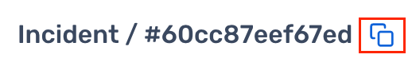
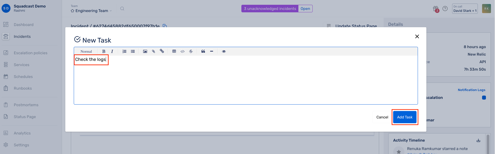
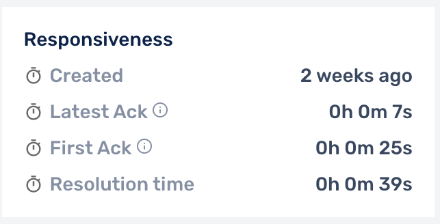
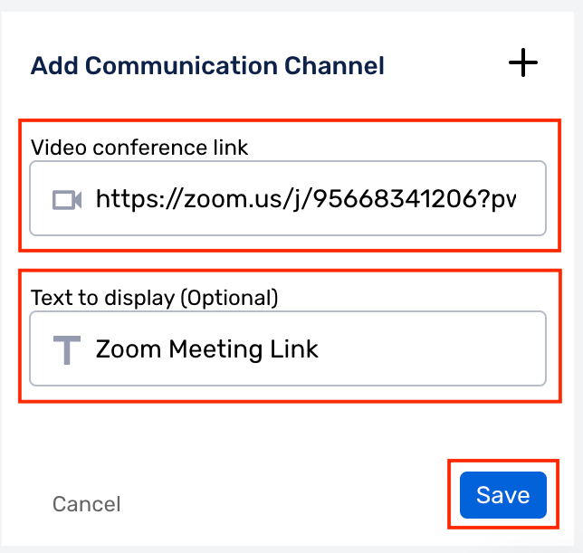
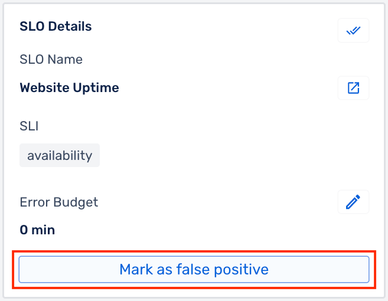
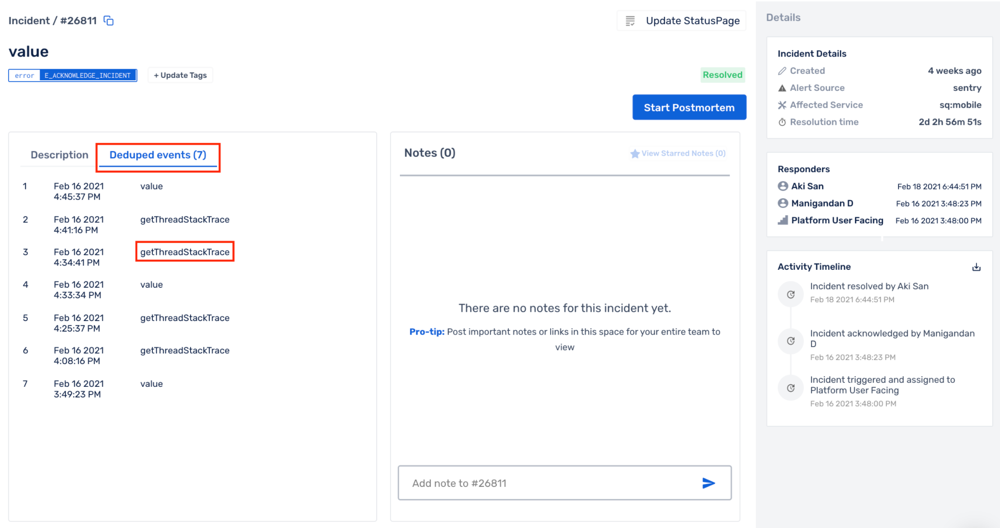
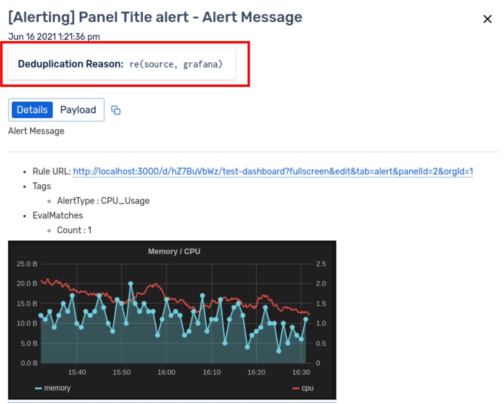

# Incidents Details

An incident represents an issue that needs to be addressed and resolved. Incidents trigger on services, and a service’s escalation policy prompts notifications to go out to on-call responders to remediate the issue.

### Incident Statues 

.png>)

### Incident Details Page

To view the Incident Details Page, select the **Team** from the team picker on the top -> Navigate to the **Dashboard** or the **Incidents** page from the sidebar and open incidents.

Click on any Incident from the Incident List to view the Incident Details page.

The Incident Details page has many components:

| Component              | Description                                                                                                                                                                                                                                                                                                                                                                                                                                                                                                                                                                                                                                                                                                                                                              |
| ---------------------- | ------------------------------------------------------------------------------------------------------------------------------------------------------------------------------------------------------------------------------------------------------------------------------------------------------------------------------------------------------------------------------------------------------------------------------------------------------------------------------------------------------------------------------------------------------------------------------------------------------------------------------------------------------------------------------------------------------------------------------------------------------------------------ |
| Incident ID            | 
A unique ID for the incident

<strong>Note</strong>: To copy this Incident URL to the clipboard, use the <strong>Copy</strong> button on the right
                                                                                                                                                                                                                                                                                                                                                                                                                                                                                                                                         |
| Incident Message       | The displayed title of the incident                                                                                                                                                                                                                                                                                                                                                                                                                                                                                                                                                                                                                                                                                                                                      |
| Incident Tags          | 
Tags are key-value pairs, added to an incident. 

They allow you to quickly see relevant information, such as severity or environment, for a particular incident rather than needing to review all of the related alerts
                                                                                                                                                                                                                                                                                                                                                                                                                                                                                                                              |
| Incident Description   | Incident Description i.e. the alert information along with images and links sent by the Alert Source                                                                                                                                                                                                                                                                                                                                                                                                                                                                                                                                                                                                                                                                     |
| Notes                  | Incident Notes enable you to add important notes for you and your team that can help mitigate an incident faster                                                                                                                                                                                                                                                                                                                                                                                                                                                                                                                                                                                                                                                         |
| Runbooks               | 
<a href="../runbooks/runbooks.md">Runbooks</a> are a “how-to” guide for completing a commonly repeated task or procedure while working on a critical incident.

<strong>Note</strong>: Simple Runbooks will be available for accounts in the <a href="https://www.squadcast.com/pricing">Pro and Enterprise plans</a>.

To attach and reference runbooks to your incident, click on the <strong>Attach Runbooks</strong> button -> Check the runbook you wish to attach -> Click <strong>Add Runbook</strong><strong></strong>
                                                                                                                                             |
| Tasks                  | 
<a href="../runbooks/runbooks.md#incident-tasks">Tasks</a> are instructions or to-dos for other team members or even follow-up tasks for an incident.

<strong>Note</strong>: Tasks will be available for accounts in the <a href="https://www.squadcast.com/pricing">Pro and Enterprise plans</a>.

To add your tasks, click on the <strong>Add Task</strong> button -> Add your Task -> Click on <strong>Add Task</strong> again, to save

Once added, you can Edit/Update and Delete the Task.
                                                                                                                                                       |
| Acknowledge            | To mark an incident as Acknowledged                                                                                                                                                                                                                                                                                                                                                                                                                                                                                                                                                                                                                                                                                                                                      |
| Reassign               | To reassign an Incident to another User, Squad or an Escalation Policy                                                                                                                                                                                                                                                                                                                                                                                                                                                                                                                                                                                                                                                                                                   |
| Resolve                | To mark an incident as Resolved                                                                                                                                                                                                                                                                                                                                                                                                                                                                                                                                                                                                                                                                                                                                          |
| Actions                | Actions are used to create JIRA tickets or take actions via [Circle CI](../integrations/extensions/circleci.md)                                                                                                                                                                                                                                                                                                                                                                                                                                                                                                                                                                                                                                                          |
| Incident Details       | 
<strong>Incident Details displays</strong>:

1. When the incident was <strong>created</strong> in Squadcast 2. <strong>Alert Source</strong> via which the incident was created 3. <strong>Affected Service</strong> for which the incident was created 4. <strong>Elapsed time</strong> since the incident got created in Squadcast

Note: Hover over the <strong>created field</strong> to view the exact Date and Time of the creation of the incident.
                                                                                                                                                                                                                       |
| Responsiveness         | 
Responsiveness displays: 1. <strong>Created</strong> - Time elapsed since the creation of the incident 2. <strong>Latest Ack</strong> - Time elapsed since the latest Acknowledgement of the incident. Will change every time the incident is reassigned 3. <strong>First Ack</strong> - Time elapsed since the first Acknowledgement of the incident 4. <strong>Resolution Time</strong> - Time elapsed from creation to the resolution of the incident
                                                                                                                                                                                                                            |
| Communication Channels | 
Communication Channels help you add video calls, chatops and external links to an incident. Additionally, you can create a dedicated Slack Channel for an incident using the Communications Card. 

To add a Communication Channel, Click on <strong>+Add Link</strong> -> Select the type of channel you want to add -> Add the link and Text to Display for your Communication Channel -> Click on <strong>Save</strong>

Once added, you can <strong>Edit/Update</strong> the Communication Channel. 

Any activity in the Communications Card, gets reflected on the Activity Timeline of the incident.
 |
| Responders             | Responders will display the list of all Users, Squads or Escalation Policies that were involved during the lifecycle of the incident. Select **Notification Logs** to open up logs of all the notifications generated for the incident                                                                                                                                                                                                                                                                                                                                                                                                                                                                                                                                   |
| Activity Timeline      | 
Activity Timeline will indicate the list of all activities performed on this incident in reverse chronological order

<strong></strong>

<strong>Note</strong>: Activity Timeline will show incident reassignment, mentioning both the assigned and assignee.

<strong></strong>

<strong>Note</strong>: Downloading Activity Timeline will be available for accounts in the <a href="https://www.squadcast.com/pricing">Pro and Enterprise plans</a>.
                                                                                                                                                                                                                                                                                        |
| SLO Details            | 
You can select the affected SLO for an incident. It will give you details on the affected SLO, SLIs and the Error Budget.

Additionally, you can mark the <strong>Incident</strong> as <strong>False Positive</strong> from here as well. 
                                                                                                                                                                                                                                                                                                                                                                                                                                                  |
| Update Status Page     | Update Status Page is used to update your Status Page for this incident                                                                                                                                                                                                                                                                                                                                                                                                                                                                                                                                                                                                                                                                                                  |
| Create Postmortem      | Create Postmortem will let you start/update the Postmortem for the incident                                                                                                                                                                                                                                                                                                                                                                                                                                                                                                                                                                                                                                                       |
| Deduped Events         | 
If the incident has deduplicated events, they will be listed under <strong>Deduped events</strong>.

By clicking on <strong>Deduped events</strong>, you will be able to see the following:

1. Number of deduplicated events 2. Event Timestamp 3. Message and Payload of the event

Clicking on any of the deduplicated events will display all the information that is sent for that alert from the monitoring tool, including the <strong>Deduplication Reason</strong> (which Deduplication Rule got executed).
                                                                                    |

### Incident Details Field Limitations 

There are certain character limitations for the Incident Message and Incident Description fields. The same is indicated below.

| Incident Field       | Character Limit |
| -------------------- | --------------- |
| Incident Message     | 250             |
| Incident Description | 15000           |
