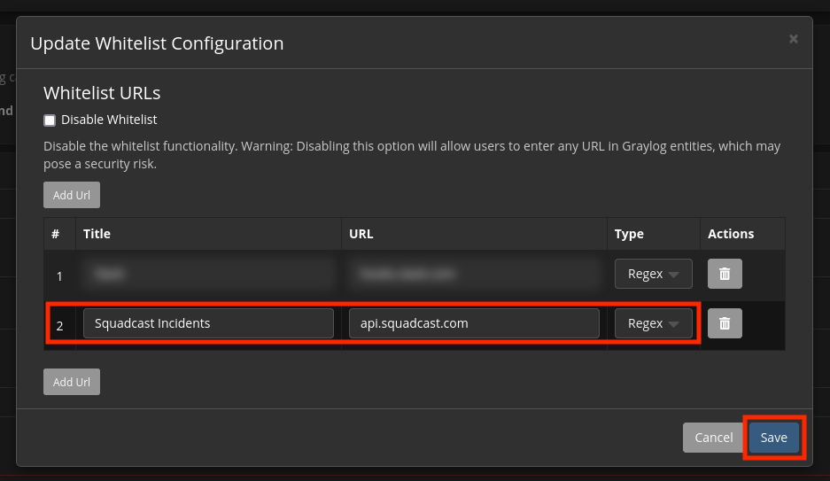

This document will help you integrate Graylog v4 with Squadcast.
 
[Graylog v4](https://www.graylog.org/products/latestversion) is a leading centralized log management solution built to open standards for capturing, storing, and enabling real-time analysis of terabytes of machine data. They deliver a better user experience by making analysis ridiculously fast and efficient using a more cost-effective and flexible architecture.
Route detailed monitoring alerts from Graylog v4 to the right users in Squadcast.

## How to integrate Graylog v4 with Squadcast

### In Squadcast: Using Graylog v4 as an Alert Source

**(1)** From the navigation bar on the left, select **Services**. Pick the applicable **Team** from the Team-picker on the top. Next, click on **Alert Sources** for the applicable Service

**(2)** Search for **Graylog v4** from the Alert Source drop-down and copy the Webhook URL

{{site.data.alerts.yellow-note-i}}
<b>Important</b>  

For an Alert Source to turn active (indicated by a <b>green dot - Receiving alerts</b> against the name of the Alert Source in the drop-down), you can either generate a test alert or wait for a real-time alert to be generated by the Alert Source.

An Alert Source is active if there is a recorded incident via that Alert Source for the Service in the last 30 days.

{{site.data.alerts.end}}

### In Graylog v4: Add a Webhook for Squadcast

**(1)** After logging in, select **Alerts** from the navigation bar on the top

**(2)** Select **Notifications**

**(3)** If you do not have any existing Notifications set up, select **Get Started**. Else, select **Create Notification** 

**(4)** Fill in the details:

(a) A meaningful **Title**
(b) An optional **Description**
(c) **Notification Type**: Select **HTTP Notification**
(d) **URL**: Paste the copied Squadcast Webhook URL
(e) Select **Add to URL Whitelist**. Here, click on **Add URL** and add:
    - A meaningful **Title**
    - **URL**: Paste `api.squadcast.com`
    - **Type**: `Regex`
    - **Save** the configuration

(f) Now, click on **Execute Test Notification** to generate a test alert and trigger a test incident in Squadcast

(g) **Save** the configuration

**(5)** Within **Alerts**, head over to **Event Definitions**. If there are no existing Event Definitions, you can create one or pick an existing Event Definition

**(6)** Navigate to **Notifications** in the set-up flow and select **Add Notification** and select the *Squadcast notification* added previously and **Save** the entire configuration in the end

That is it, you are now good to go! Whenever an alert is triggered in Graylog v4, an incident will be created automatically in Squadcast.

{{site.data.alerts.blue-note}}
<b>FAQ:</b>
  
Q: If an alert gets resolved in Graylog v4, does Graylog v4 send auto-resolve signals to Squadcast?  A: No, Graylog v4 does not send any auto-resolve signals to Squadcast. Incidents for alerts from Graylog v4 need to be manually resolved in Squadcast.

{{site.data.alerts.end}}