# LogicMonitor

This document will help you integrate LogicMonitor with Squadcast.

[LogicMonitor](https://www.logicmonitor.com/) is a fully-automated, cloud-based infrastructure monitoring platform for Enterprise IT and Managed Service Providers giving full-stack visibility into networks, cloud, servers with one unified view. Route detailed monitoring alerts from LogicMonitor to the right users in Squadcast.

### How to integrate LogicMonitor with Squadcast

#### In Squadcast: Using LogicMonitor as an Alert Source

**(1)** From the navigation bar on the left, select **Services**. Pick the applicable **Team** from the Team-picker on the top. Next, click on **Alert Sources** for the applicable Service


**(2)** Search for **LogicMonitor** from the Alert Source drop-down and copy the Webhook URL

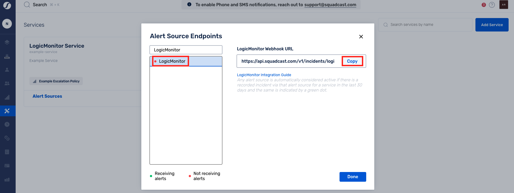


**Important**

For an Alert Source to turn active (indicated by a **green dot - Receiving alerts** against the name of the Alert Source in the drop-down), you can either generate a test alert or wait for a real-time alert to be generated by the Alert Source.

An Alert Source is active if there is a recorded incident via that Alert Source for the Service in the last 30 days.


#### In LogicMonitor: Add a webhook for Squadcast

**(1)** From the dashboard, navigate to **Settings**

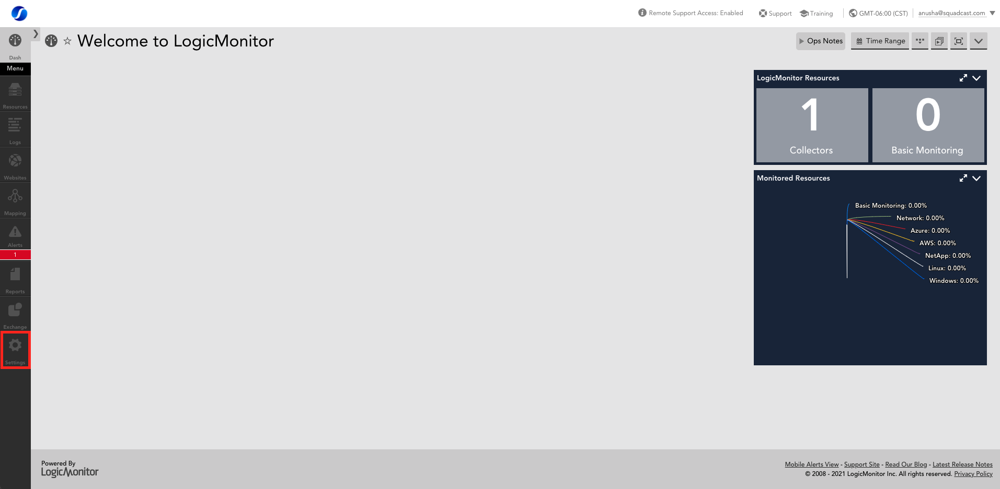

**(2)** Select **Integrations** from the sidebar

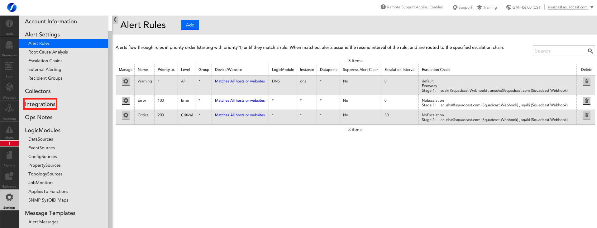

**(3)** Select **Add** to add the new endpoint

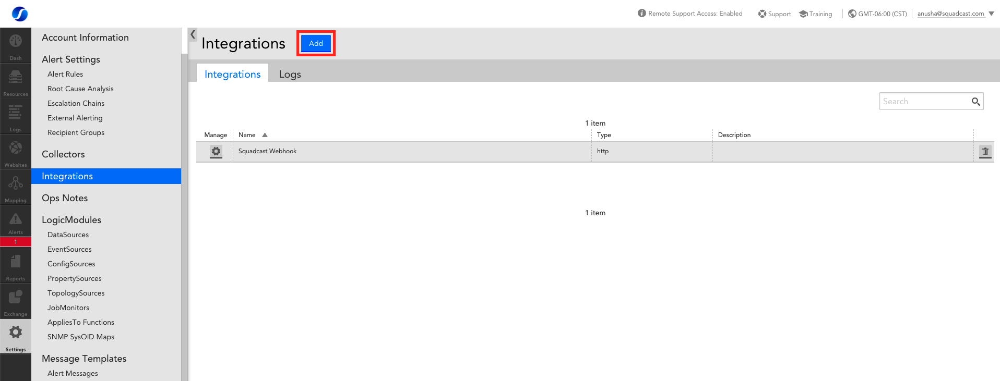

**(4)** Select **Custom HTTP Delivery** since we want to configure a custom webhook

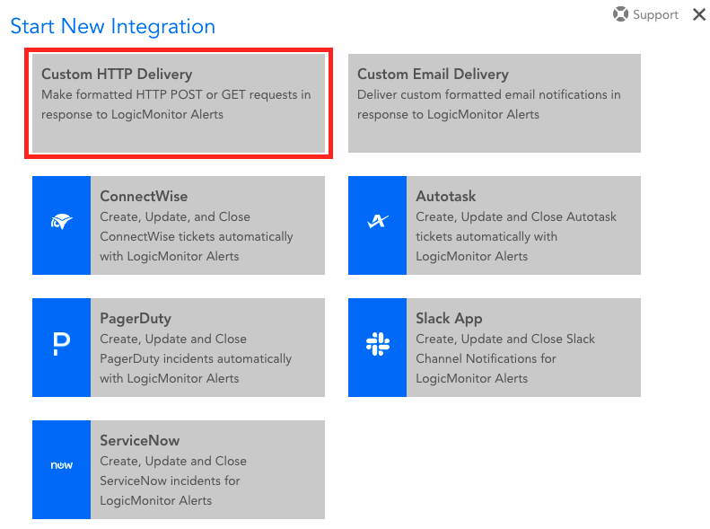

* Give the integration a meaningul **Name**, such as, _Squadcast Webhook_
* Provide an _optional_ **Description**
* You can either choose to **Use the same URL and data to notify on various alert activity** (one single Squadcast Service webhook) or **Use differents URLs or data formats to notify on various alert activity** (multiple Squadcast Services webhooks). Either of the options you choose, you can follow the steps below, as many times as required (per each webhook)
* Choose **Cleared** checkbox since this will enable **auto-resolution** for incidents in Squadcast
* **HTTP Method**: From the drop-down, choose **HTTP Post**. Do _not_ enable/use Custom Headers
* In the **URL** field, first select **https://** from the drop-down on the left and paste the copied Squadcast webhook by removing the _https://_ prefix from the URL
* Provide **Username** and **Password** if applicable

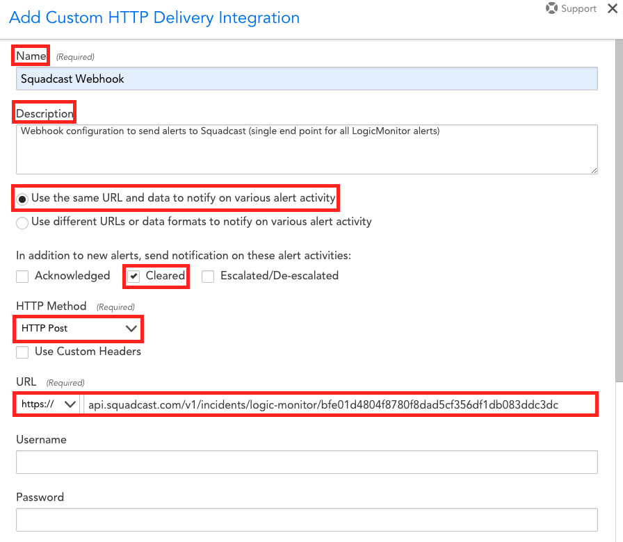

* Within **Alert Data**, paste the following template:

```
service=##SERVICE##&alertid=##ALERTID##&alerttype=##ALERTTYPE##&alertstatus=##ALERTSTATUS##&level=##LEVEL##&host=##HOST##&datasource=##DATASOURCE##&eventsource=##EVENTSOURCE##&batchjob=##BATCHJOB##&group=##GROUP##&datapoint=##DATAPOINT##&start=##START##&finish=##FINISH##&duration=##DURATION##&value=##VALUE##&threshold=##THRESHOLD##&userdata=##USERDATA##&cmdline=##CMDLINE##&exitCode=##EXITCODE##&stdout=##STDOUT##&stderr=##STDERR##&agent=##AGENT_DESCRIPTION##&checkpoint=##CHECKPOINT##&datapointdesc=##DPDESCRIPTION##&hostdesc=##HOSTDESCRIPTION##&hostinfo=##system.sysinfo##&hostips=##system.ips##&hosturl=##DEVICEURL##&instance=##INSTANCE##&dsidesc=##DSIDESCRIPTION##&batchdesc=##BJDESCRIPTION##&hostname=##system.hostname##&dsdesc=##DSDESCRIPTION##&eventmsg=##LIMITEDMESSAGE##&eventlogmsg=##MESSAGE##&eventcode=##EVENTCODE##&eventtype=##TYPE##&eventuser=##USER##&eventlogfile=##LOGFILE##&servicedetail=##DETAIL##&serviceurl=##URL##&servicegroup=##SERVICEGROUP##&date=##DATE##&clearvalue=##CLEARVALUE##&internalid=##INTERNALID##&alerturl=##ALERTDETAILURL##
```

\{{site.data.alerts.blue-note-md\}} **Note: Custom User Defined Variables**

Users can define two custom variables within **Alert Data**. The two variables can be added in the format mentioned below :

**\&CustomVariable1Name=##Name##\&CustomVariable1Value=##Value## \&CustomVariable2Name=##Name##\&CustomVariable2Value=##Value##**

Replace the **##Name##** & **##Value##** with proper values and add at the end of the variables mentioned in **Step 4**. This is how it would look like :

```
service=##SERVICE##&alertid=##ALERTID##&alerttype=##ALERTTYPE##&alertstatus=##ALERTSTATUS##&level=##LEVEL##&host=##HOST##&datasource=##DATASOURCE##&eventsource=##EVENTSOURCE##&batchjob=##BATCHJOB##&group=##GROUP##&datapoint=##DATAPOINT##&start=##START##&finish=##FINISH##&duration=##DURATION##&value=##VALUE##&threshold=##THRESHOLD##&userdata=##USERDATA##&cmdline=##CMDLINE##&exitCode=##EXITCODE##&stdout=##STDOUT##&stderr=##STDERR##&agent=##AGENT_DESCRIPTION##&checkpoint=##CHECKPOINT##&datapointdesc=##DPDESCRIPTION##&hostdesc=##HOSTDESCRIPTION##&hostinfo=##system.sysinfo##&hostips=##system.ips##&hosturl=##DEVICEURL##&instance=##INSTANCE##&dsidesc=##DSIDESCRIPTION##&batchdesc=##BJDESCRIPTION##&hostname=##system.hostname##&dsdesc=##DSDESCRIPTION##&eventmsg=##LIMITEDMESSAGE##&eventlogmsg=##MESSAGE##&eventcode=##EVENTCODE##&eventtype=##TYPE##&eventuser=##USER##&eventlogfile=##LOGFILE##&servicedetail=##DETAIL##&serviceurl=##URL##&servicegroup=##SERVICEGROUP##&date=##DATE##&clearvalue=##CLEARVALUE##&internalid=##INTERNALID##&alerturl=##ALERTDETAILURL##&CustomVariable1Name=##Name##&CustomVariable1Value=##Value##&CustomVariable2Name=##Name##&CustomVariable2Value=##Value##
```

\{{site.data.alerts.blue-note-md\}} **Note: Custom User Defined Incident Message**

Users can define custom Incident Message within **Alert Data**. The variable can be added in the format mentioned below :

**\&CustomIncidentMessage=##IncidentMessage##**

Replace the **##IncidentMessage##** with proper values and add at the end of the variables mentioned in **Step 4**. This is how it would look like :

```
service=##SERVICE##&alertid=##ALERTID##&alerttype=##ALERTTYPE##&alertstatus=##ALERTSTATUS##&level=##LEVEL##&host=##HOST##&datasource=##DATASOURCE##&eventsource=##EVENTSOURCE##&batchjob=##BATCHJOB##&group=##GROUP##&datapoint=##DATAPOINT##&start=##START##&finish=##FINISH##&duration=##DURATION##&value=##VALUE##&threshold=##THRESHOLD##&userdata=##USERDATA##&cmdline=##CMDLINE##&exitCode=##EXITCODE##&stdout=##STDOUT##&stderr=##STDERR##&agent=##AGENT_DESCRIPTION##&checkpoint=##CHECKPOINT##&datapointdesc=##DPDESCRIPTION##&hostdesc=##HOSTDESCRIPTION##&hostinfo=##system.sysinfo##&hostips=##system.ips##&hosturl=##DEVICEURL##&instance=##INSTANCE##&dsidesc=##DSIDESCRIPTION##&batchdesc=##BJDESCRIPTION##&hostname=##system.hostname##&dsdesc=##DSDESCRIPTION##&eventmsg=##LIMITEDMESSAGE##&eventlogmsg=##MESSAGE##&eventcode=##EVENTCODE##&eventtype=##TYPE##&eventuser=##USER##&eventlogfile=##LOGFILE##&servicedetail=##DETAIL##&serviceurl=##URL##&servicegroup=##SERVICEGROUP##&date=##DATE##&clearvalue=##CLEARVALUE##&internalid=##INTERNALID##&alerturl=##ALERTDETAILURL##&CustomVariable1Name=##Name##&CustomVariable1Value=##Value##&CustomVariable2Name=##Name##&CustomVariable2Value=##Value##&CustomIncidentMessage=##IncidentMessage##
```

Enable **Raw**. Additionally, from the **Format** drop-down, select **Form Data**

* Do _not_ enable the checkbox for **Include an ID provided in HTTP response when updating alert status**

**(5)** Click on **Test Alert Delivery**. This is will send a _Test_ alert to Squadcast, triggering a _Test_ incident. Verify this to ensure the integration is working as expected

**(6)** **Save** the integration configuration

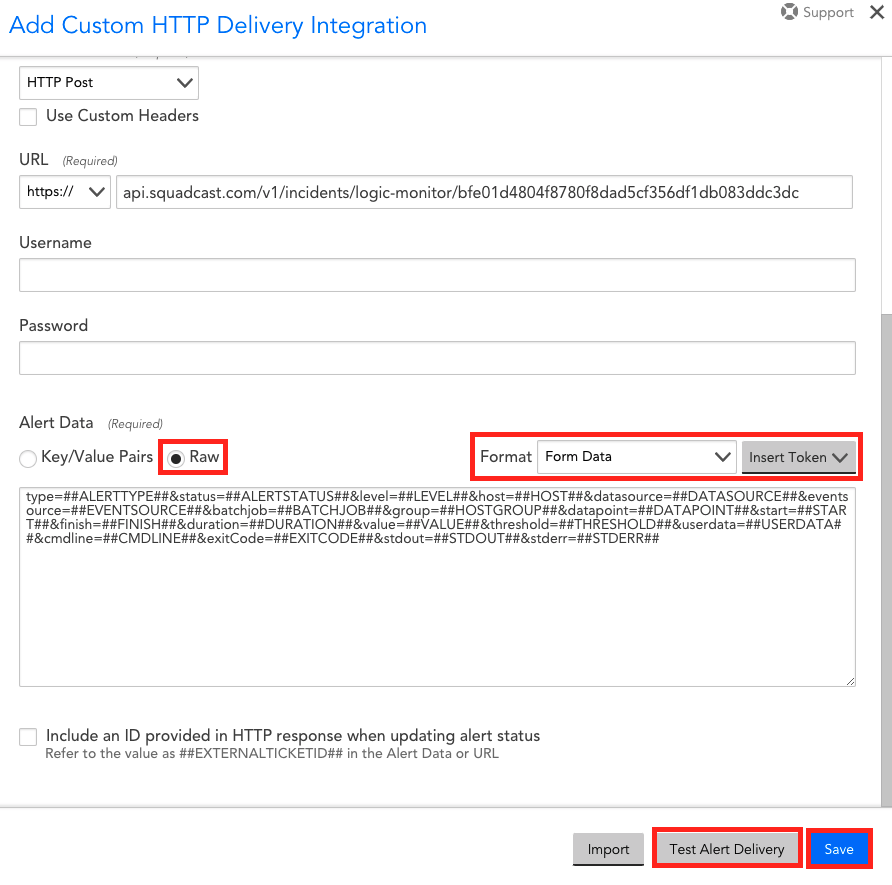

Find more details on how each of these parameters for **Custom HTTP Endpoints** can be configured [here](https://www.logicmonitor.com/support/alerts/integrations/custom-http-delivery)

**(7)** Select **Escalation Chains** from the sidebar. Either **Add** a new Escalation Chain or edit an existing one

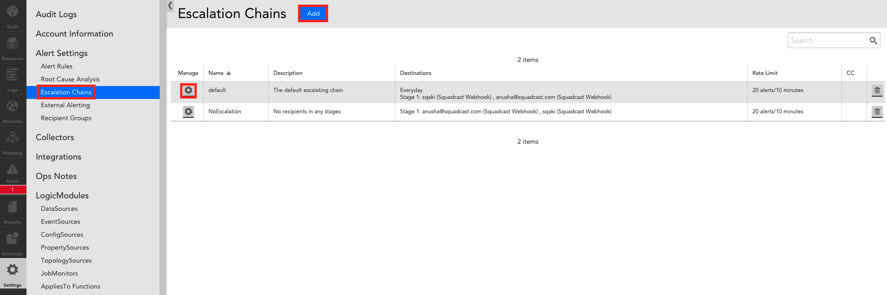

**(8)** Configure the _Squadcast Webhook_ within your Escalation Chain and **Save** it

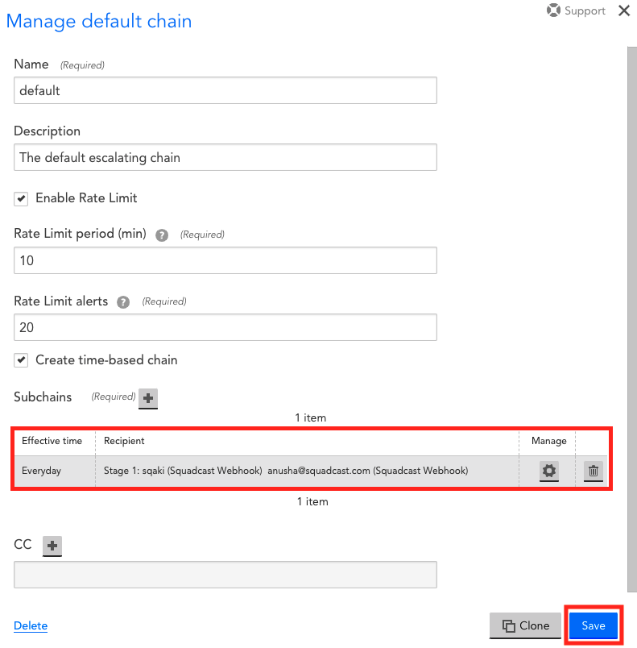

Find more details on how each of these parameters for **Escalation Chains** can be configured [here](https://www.logicmonitor.com/support/alerts/alert-delivery/escalation-chains)

**(9)** Select **Alert Rules** from the sidebar from under **Alert Settings**. Either **Add** a new Alert Rule or edit an existing one

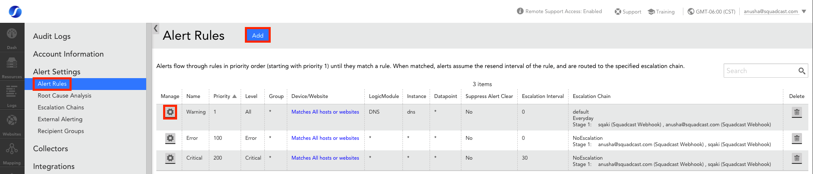

**(10)** Fill in all the relevant details. _Enable_ the checkbox **Send notification when alerts clear**. Choose the configured **Escalation Chain** from the drop-down and **Save** it

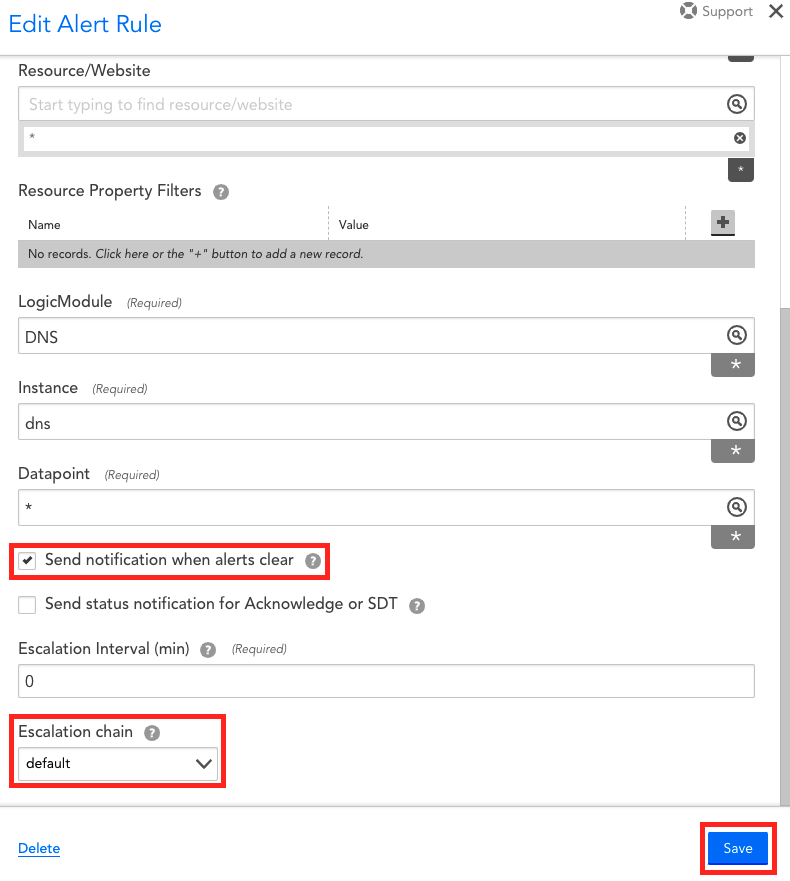

Find more details on how each of these parameters for **Alert Rules** can be configured [here](https://www.logicmonitor.com/support/alerts/alert-delivery/alert-rules)

That is it, you are now good to go! Whenever an alert is triggered in LogicMonitor, an incident will be created automatically in Squadcast.

\{{site.data.alerts.blue-note\}} **FAQ:**\
\


Q: If an alert gets resolved in LogicMonitor, does LogicMonitor send auto-resolve signals to Squadcast?\
\
A: Yes, LogicMonitor sends auto-resolve signals to Squadcast.
