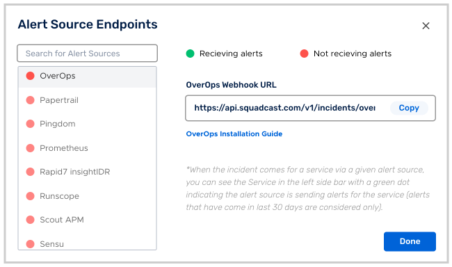
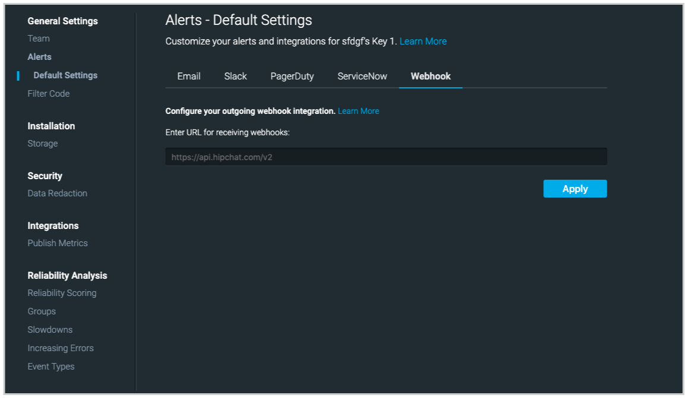
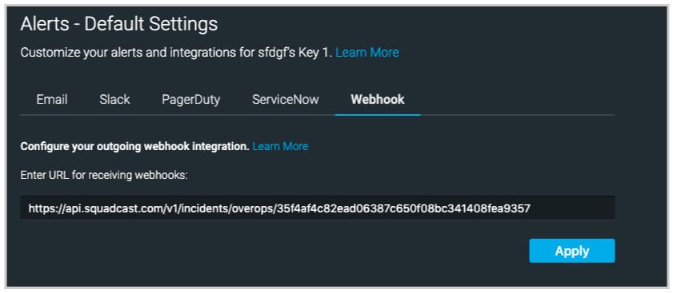

Follow the steps below to configure a service so as to extract its related alert data from Splunk. Squadcast will then process this information to create incidents for this service as per your preferences.

## Using OverOps as an Alert Source in Squadcast

**(1)** From the navigation bar on the left, select **Services**. Pick the applicable **Team** from the Team-picker on the top. Next, click on **Alert Sources** for the applicable Service

**(2)** Search for **OverOps** from the Alert Source drop-down and copy the Webhook URL

 
<b>Important</b>  

For an Alert Source to turn active (indicated by a <b>green dot - Receiving alerts</b> against the name of the Alert Source in the drop-down), you can either generate a test alert or wait for a real-time alert to be generated by the Alert Source.

An Alert Source is active if there is a recorded incident via that Alert Source for the Service in the last 30 days.



## Create a Squadcast Webhook alert in OverOps

In your OverOps dashboard, click on the **Settings** icon, select **Alerts** and then select the **Webhooks** tab.

Paste the OverOps webhook URL that you have got from the previous step in the URL box and click **Apply** button.

That's it! Now your integration is good to go. Then you can configure alerts the usual way and it will be automatically created in Squadcast.