This document will help you integrate Stackdriver with Squadcast.

[Stackdriver](https://cloud.google.com/monitoring/docs) offers monitoring of a wide variety of metrics, dashboards, alerting, log management, reporting, and tracing capabilities.

Route detailed events from Stackdriver to the right users in Squadcast.

## How to integrate Stackdriver with Squadcast

### In Squadcast: Using Stackdriver as an Alert Source

**(1)** From the navigation bar on the left, select **Services**. Pick the applicable **Team** from the Team-picker on the top. Next, click on **Alert Sources** for the applicable Service

**(2)** Search for **Stackdriver** from the Alert Source drop-down and copy the Webhook URL

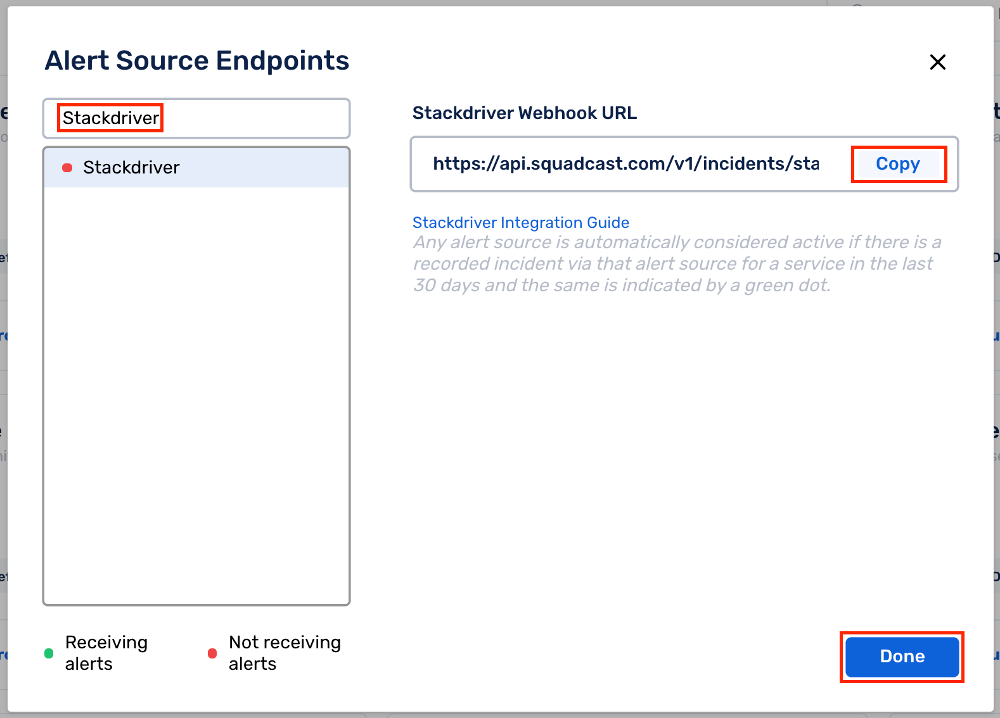

 
<b>Important</b>  

For an Alert Source to turn active (indicated by a <b>green dot - Receiving alerts</b> against the name of the Alert Source in the drop-down), you can either generate a test alert or wait for a real-time alert to be generated by the Alert Source.

An Alert Source is active if there is a recorded incident via that Alert Source for the Service in the last 30 days.



## In Stackdriver: Adding a Webhook for Squadcast

Login to your Google Cloud console. From the sidebar on the left, scroll to find **Operations** and select **Monitoring**

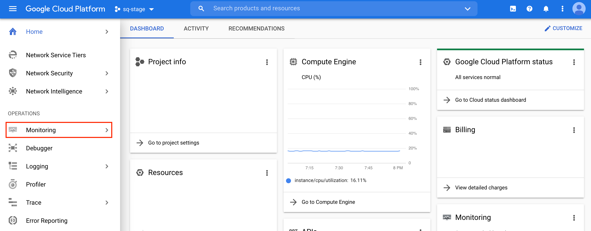

### Adding a Notification Channel - Webhooks

**(1)** From the left sidebar, select **Alerting**

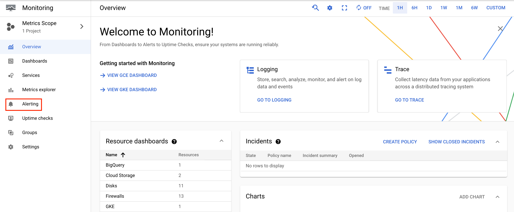

**(2)** Select **Edit Notification Channels**

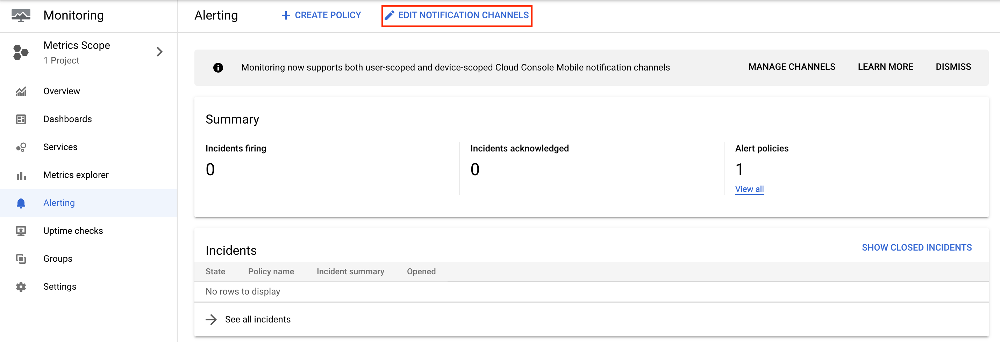

**(3)** Scroll until you find **Webhooks**. Here, click on **Add New** to add the Squadcast Webhook

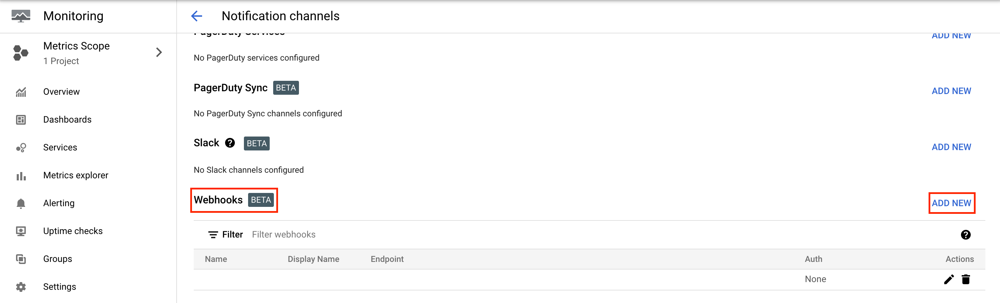

**(4)** Here, paste the previously copied Webhook from Squadcast under **Endpoint URL**. Give the Webhook a meaningful **Displaye Name**. 

**Things to keep in mind here**: 
- **Do not enable** the checkbox for using HTTP Basic Auth
- When you paste the Webhook from Squadcast in **Endpoint URL** field, ensure you remove the additional `https://` that gets added

**(5)** Click on **Test Connection** and check to see if an incident has been created for the incident in Squadcast 

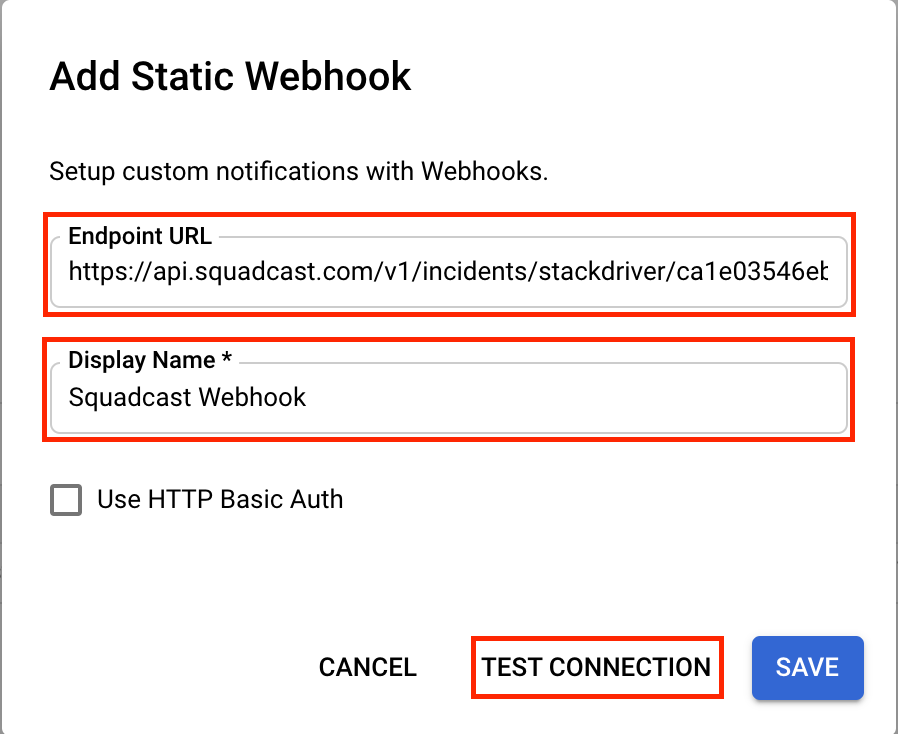

**(6)** Finally, click on **Save**

### Setting up Alerting Policies

**(1)** Within the **Alerting** page, to add a **Policy**, click on either **+ Create Policy** on the top or **Add Policy** in the bottom

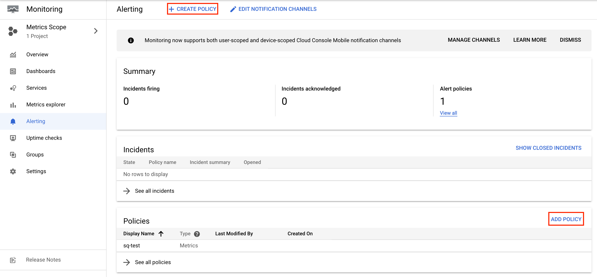

**(2)** Now, **Add Condition** for your **Policy**. In that page, you can set up the metrics that you would wish to monitor and their thresholds, along with the resources

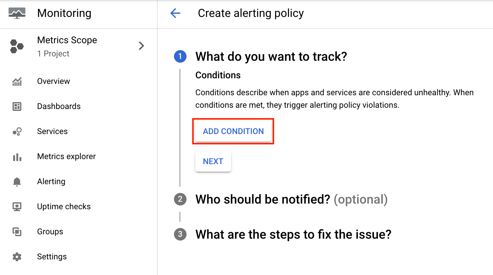

**(3)** Once that is done, select **Next**

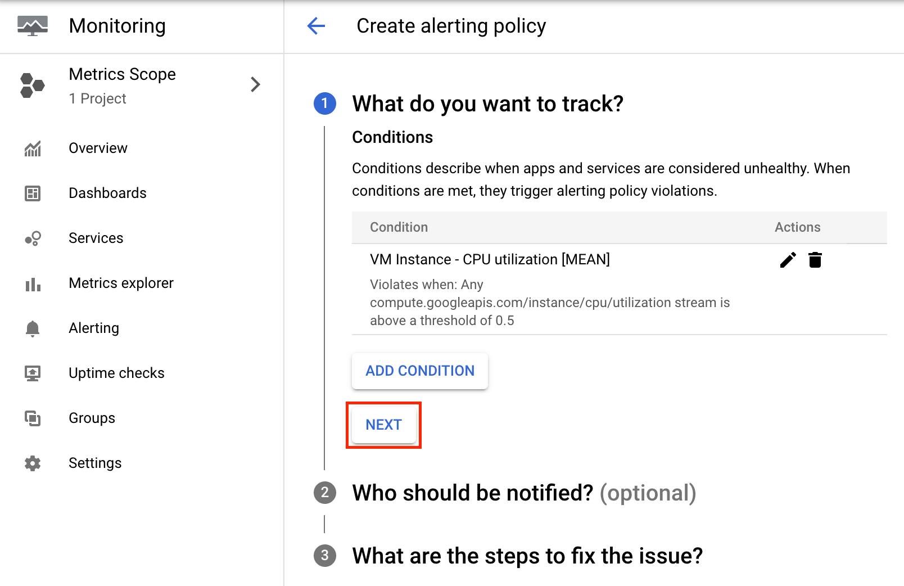

**(4)** In the **Notification Channels** dropdown, select the Webhook previously configured for Squadcast and select **OK**

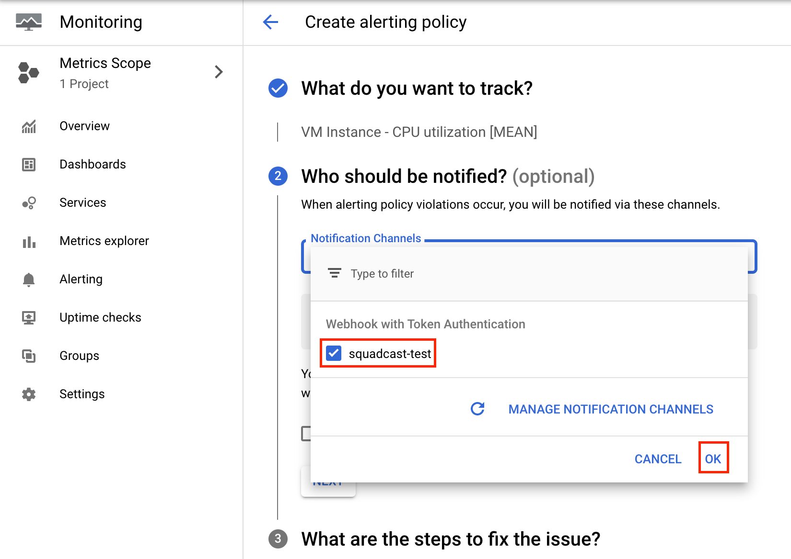

**(5)** Enable the checkbox as shown in the screenshot to receive **Incident Resolutions signals** as well. Then, select **Next**

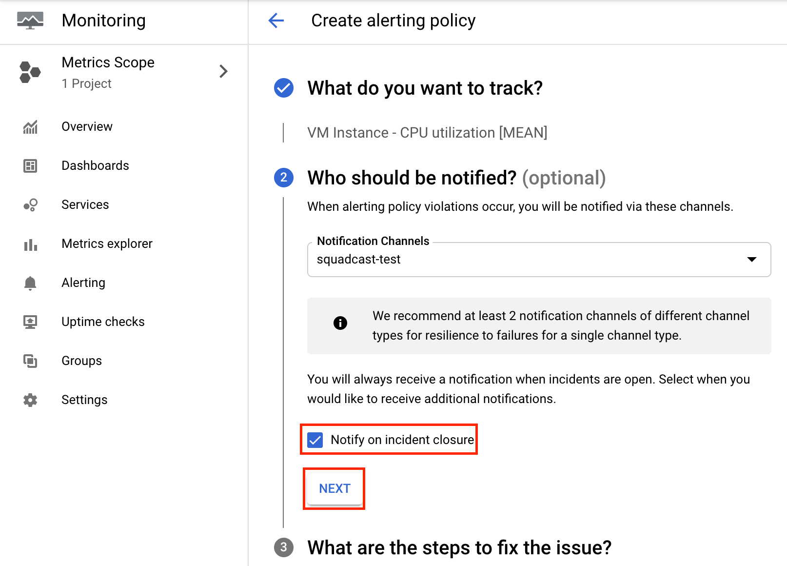

**(6)** Here, add a meaningul **Alert Name**, add **Optional Documentation** and click on **Save** to create your **Alerting Policy**

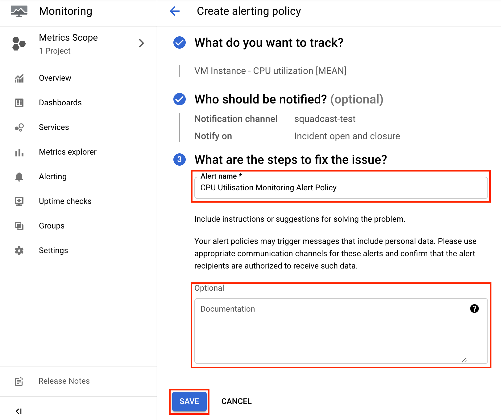

**(7)** Once everything is done, in the **Policies** page, you will be able to see the previously added **Alerting Policy**. Ensure that the **Alerting Policy** toggle is **Enabled** to `on`

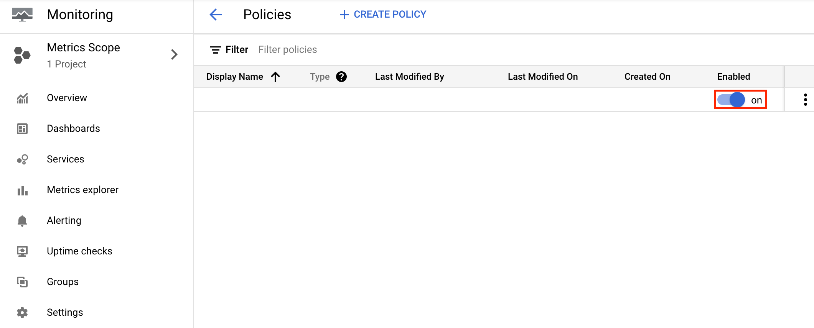

That is it, you are now good to go! Whenever an alert is generated in Stackdriver, an incident will be created for the same in Squadcast.

{{site.data.alerts.blue-note}}
<b>FAQ:</b>
  
Q: Does this integration support auto-resolution of incidents in Squadcast?  
A: Yes, this integration **supports auto-resolution of incidents in Squadcast**, meaning that whenever alerts get resolved in Stackdriver, the corresponding incidents will be automatically resolved in Squadcast as well. If you do not enable the checkbox to <b>recieve Incident Resolution signals</b>, then your Squadcast incidents will not be auto-resolved when alerts in Stackdriver are resolved.

