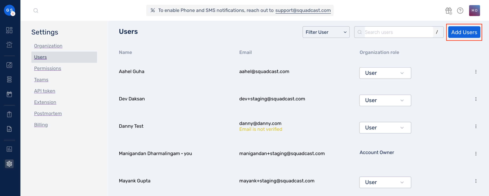
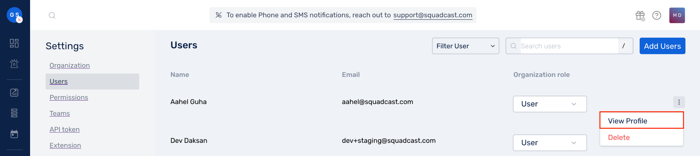

# Add and Delete Users

### Add Users 

Add users to your Organization by following the steps below:

1. Click on **Settings** in the sidebar

 (1) (1) (10) (34).png>)

2\. Click on **Users** from the secondary navigation menu

 (2) (15).png>)

3\. Click on **Add Users** on the top right corner

Here, fill in the following details to invite users into your Organization:

* First Name
* Last Name
* Email
* User Type (<mark style="color:red;">`Account Owner`</mark>, <mark style="color:red;">`User`</mark>, <mark style="color:red;">`Stakeholder`</mark>)


**Note:**

To import multiple users to your Organization in one go, you can simply drag and drop a `.csv` file or, click on `select a file from your computer` on the top of the page to bulk import users. More information on this is available [here](https://support.squadcast.com/docs/import-users).



**Note:**

If one wants to view the **Profile** of another user added in the Organization, for the added user, click on the More Option and select **View Profile** to do so.



4\. Click on the **Send Invites** button, on the bottom left, to invite these newly added users to your Organization

* The invited user will receive an email for verification. Until the user has been successfully verified, you will notice an icon indicating that <mark style="color:red;">`Verification Is Pending`</mark> against that User.
* You can choose to resend the verification email by clicking on the <mark style="color:red;">`Verification Is Pending`</mark> icon should that be necessary. Please ensure that you check not only your _Inbox_, but also _Spam_ or _Promotions_ folders to ensure the verification email ended up landing there.


**Note:**

You cannot change or transfer the Account Ownership using this _Add Users_ flow. This needs to be done after the users have been imported.


### Delete Users 

Remove/delete users added to your Organization by following the steps below:

1. Click on **Settings** in the sidebar

 (1) (1) (10) (32).png>)

2\. Click on **Users** from the secondary navigation menu

 (2) (12).png>)

3\. Click on the <mark style="color:red;">`More Options`</mark> icon and select **Delete** to delete the user

4\. If the user is part of any Team, a modal listing all the Teams that the user is a part of, appears as shown below

.png>)

Users who are part of some team can’t be deleted. You’ll have to remove them from the team before deleting them.
