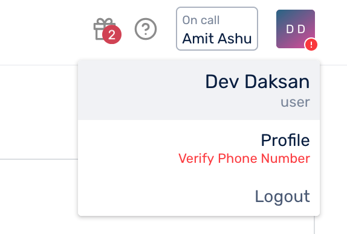
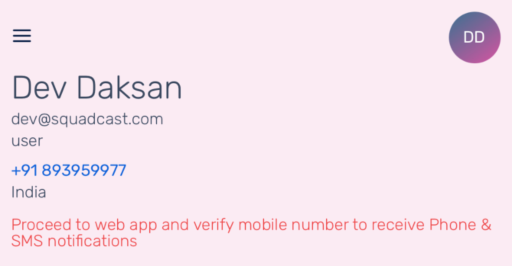

# Manage Your Profile

### Profile Page 

1. Click on the user icon in the upper right corner and select **Profile**

2\. On your **Profile** page, you can:

1. Edit your _First Name_ and _Last Name_
2. _Change Password_
3. _Change Phone Number_
4. Update Personal Notification Rules. Additionally, if your Squadcast Organization is integrated with Slack/Google Hangouts, the same will be indicated here as well
5. Update On-Call reminder Notification Rules
6. View the Escalation Policies, Squads and Schedules you are a part of
7. Generate and view existing API Refresh Tokens
8. For the past week, view the number of incidents Acknowledged and Resolved by you, along with MTTA and MTTR

### Edit Profile 

1. Click on **More Options** icon, and select **Edit**
2. Fill out the details and click **Save**

### Change Password 

1. Click on **More Options Icon**, and select **Change Password**
2. Fill out _Current Password_, _New Password_ and _Re-enter New Password_
3. Click on **Save**

### Change Mobile Number 

1. Click on **More Options Icon**, and select **Change Phone Number**
2. Select your country _Dial Code_ and fill in the _Mobile Number_
3. Click on **Verify**

.png>)

4\. An OTP will be sent to you, fill in the OTP and click **Submit**

.png>)

5\. If you did not receive an OTP, you can click on **Send again** to get a new OTP. **Send again** will only be enabled after 1 minute has passed every-time an OTP is sent. You can also click on **Skip and verify later** to verify the _Mobile Number_ later

.png>)

### Mobile Number Verification 


**Disclaimer:**

1. For existing users of Squadcast, they will continue receiving Phone and SMS notifications as usual until **September 1st, 2021**. Post this, unless their Mobile Number is verified, they will not receive Phone and SMS notifications
2. For new users of Squadcast, please verify your Mobile Number in order to start receiving Phone and SMS notifications post signing up



**Note:**

1. In order to receive Phone and SMS notifications, ensure a valid Mobile Number is entered
2. Phone and SMS notifications will be disabled if the Mobile Number is not verified
3. Everytime you change your Mobile Number, you have to verify the new Mobile Number to continue receiving Phone and SMS notifications


### While Onboarding 

1. Enter the details, _Mobile Number_ is **optional**. You can add a _Mobile Number_ later in your **Profile** page

2\. If _Mobile Number_ is provided, a One-time Password (OTP) will be sent to you through SMS and you will be taken to the OTP verification screen

1. Fill in the OTP and click on **Verify** to verify your _Mobile Number_
2. If you did not receive an OTP, you can click on **Send again** to get a new OTP. **Send again** will only be enabled after 1 minute has passed every-time an OTP is sent
3. If you want to verify your _Mobile Number_ later, you can select **Skip and verify later**. _Mobile Number_ can be verified in the [**Profile page**](manage-your-profile.md)****
4. You will then be logged in, irrespective of whether you choose to verify instantly or at a later point in time

### In Profile Page 

To verify _Mobile Number_

1. Click on **Verify Phone Number**

2\. An OTP will be sent to your _Mobile Number_. Fill in the OTP and **Submit**

3\. If you did not receive an OTP, you can click on **Send again** to get a new OTP. **Send again** will only be enabled after 1 minute has passed every-time an OTP is sent. You can also click on **Skip and verify later** to verify the _Mobile Number_ later

.png>)

4\. After verification is complete, the warning message will disappear and you will receive Phone & SMS notifications for incidents


**Note:**

If the Mobile Number is not verified via OTP, the same will be indicated in the web app as well as the mobile app.

**In the web app:**

**In the mobile app:**

Navigate to **My Profile**:


