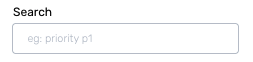

# Alert Deduplication Rules



Alert Deduplication can help you reduce alert noise by organising and grouping alerts. This also provides easy access to similar alerts when needed.

This can be achieved by defining Deduplication Rules for each Service in Squadcast. When these rules evaluate _true_ for an incoming incident, alerts will get deduplicated.

### Prerequisites <a href="#prerequisites" id="prerequisites"></a>

* The User Role associated with the user in the Team must have required permissions to manage Services (ability to manage Deduplication Rules).
* Integrate with an Alert Source and ensure that the Alert Source has started sending alerts to Squadcast before setting up Deduplication Rules.


**Important**\
Deduplication Rules work only on incidents in either the **Triggered** or **Acknowledged** states.


### Creating Deduplication Rules <a href="#creating-deduplication-rules" id="creating-deduplication-rules"></a>

Ensure that the right Team is chosen from the team picker on the top of the screen.

1. Click on **Services** in the primary navigation
2. Select a **Service** and click on the **More options** icon
3. Click on **Deduplication Rules**


4\. Click on **Add new rule**

5\. Select an **Alert Source** from the drop-down


6\. Deduplication Rules can be added in two ways:

#### A. UI-based Rule Builder (Beginner-friendly) <a href="#a-ui-based-rule-builder-beginner-friendly" id="a-ui-based-rule-builder-beginner-friendly"></a>

1. On the right, you can view the _payload of the **latest** alert_ for the chosen Alert Source
2. The drop-downs in the Rule Builder contain values from the payload on the right. You can use them to easily create your Deduplication Rules


3\. You can add more than 1 condition for a rule by selecting **Add Condition** (a logical AND is performed between all the conditions -> the entire Deduplication Rule will evaluate to <mark style="color:red;">`True`</mark> only if all the conditions evaluate to <mark style="color:red;">`True`</mark>)

Next, choose the **Deduplication Time Window**. You can deduplicate incidents for a **maximum of 48 hours**.


**Time Window**

During the set time window, incidents that occur are compared against all incidents that come in during that time period, and will then get deduplicated against the first incident that it matches with.


4\. Click on **Save**


#### B. Raw String Method <a href="#b-raw-string-method" id="b-raw-string-method"></a>


**Important**

Once you opt for the **Raw String method**, you cannot revert to the **UI-based Rule Builder** method for that rule.


1. On the right, you can view the payload of the latest alert for the chosen Alert Source
2. Click on **Edit** to enable the Raw String method


3\. Write your custom Deduplication Rule expression. Below are some examples to help you get started:

**Supported Rules**

The rule engine supports expressions with parameters, arithmetic, logical, and string operations.

**Basic Expressions**

$$
10 > 0, 1+2, 100/3
$$

**Parameterized Expressions**

$$
past.metric == current.metric
$$

The available parameters are <mark style="color:red;">`past`</mark>, <mark style="color:red;">`current`</mark> and <mark style="color:red;">`event_count`</mark> + <mark style="color:red;">`past`</mark>: This parameter contains the JSON payload of the previous incident which the current event is compared with + <mark style="color:red;">`current`</mark>: This parameter contains the JSON payload of the incoming event which will be compared with the past incidents’ JSON payload + <mark style="color:red;">`event_count`</mark>: This denotes the number of deduplicated events for a given incident


**Use-case for event\_count:**

This can be used in scenarios where you do not want to deduplicate more than <mark style="color:red;">`n`</mark> number of alerts to a particular incident.


**Regular Expressions**

This can be used to check if a particular JSON payload field matches a regular expression.

$$
re(payload.metric, "disk.*")
$$

**Parse JSON content within the payload using **<mark style="color:red;">**`jsonPath`**</mark>

**General Format**&#x20;

<mark style="color:red;">`jsonPath(<the JSON string that should be parsed for JSON content>, <"the parameter that needs to be picked from the parsed JSON object">)`</mark>

**Example**&#x20;

Below is an example payload:

```
{
	"payload": {
		"Type": "Notification",
		"MessageId": "5966c484-5b37-58df",
		"TopicArn": "arn:aws:sns:us-east-1:51:Test",
		"Message": "{\"AlarmName\":\"Squadcast Testing - Ignore\",\"AlarmDescription\":\"Created from EC2 Console\"}"
	}
}
```

```
jsonPath(payload.Message, "AlarmName");
```

This will pick out the value <mark style="color:red;">`AlarmName`</mark> from the Message object in the payload, based on which, you can de-duplicate incidents.


**Multiple Alert Sources**

We can see alert payloads of past events from different alert sources for the Service by selecting the respective alert source from the dropdown in the right-half side.

\
Since the payload format is fixed for a given alert source, it is usually preferable to have Deduplication Rules on a per-alert source basis. This can be done by making use of the <mark style="color:red;">`source`</mark> field which lets you know the alert source that triggered the incoming event.\
\
For example, if you want to have a Deduplication Rule for a Service, only for alerts coming for <mark style="color:red;">`grafana`</mark> alert source, then the corresponding rule would look something like: <mark style="color:red;">`source == 'grafana' && (<your_deduplication_rule>)`</mark>


**Example**

Below is an example payload for demonstration:

```
{
	"event_count": 5,
	"past": {
		"issue_description": "bug - 2",
		"issue_id": "10029",
		"issue_key": "HYD-30",
		"issue_labels": [],
		"issue_link": "http://13.233.254.18:8080/browse/HYD/issues/HYD-30",
		"issue_priority": "Medium",
		"issue_summary": "bug - 2",
		"issue_type": "Bug",
		"project_id": "10000",
		"project_key": "HYD",
		"project_name": "hydra"
	},
	"source": "grafana"
}
```

To deduplicate any incoming alert when:

* The <mark style="color:red;">`metric`</mark> matches the regular expression <mark style="color:red;">`^disk.*`</mark>
* The <mark style="color:red;">`past`</mark> incident <mark style="color:red;">`metric`</mark> and the <mark style="color:red;">`current`</mark> event <mark style="color:red;">`metric`</mark> are the same
* The <mark style="color:red;">`past`</mark> incident <mark style="color:red;">`host`</mark> and the <mark style="color:red;">`current`</mark> event <mark style="color:red;">`host`</mark> are the same
* The <mark style="color:red;">`current`</mark> disk usage <mark style="color:red;">`value`</mark> is less than 60%
* The <mark style="color:red;">`context`</mark> value tag is same

**Deduplication Rule:**

```
past.metric == current.metric &&
	re(current.metric, "^disk.*") &&
	past.host == current.host &&
	current.value < 60 &&
	jsonPath(past.tags, "context.value") ==
		jsonPath(current.tags, "context.value");
```

### Viewing Deduplicated Incidents <a href="#viewing-deduplicated-incidents" id="viewing-deduplicated-incidents"></a>

From the [Incidents](../../incident-list/incident-list-view.md) page, you can view which incidents have deduplicated events when there is a **+\<number>** next to the Incident ID like in the screenshot below.

The **number** indicates how many alerts were deduplicated against this incident.


Clicking on such an incident will take you to its [Incident Details](../../incidents-page/incidents-details.md) page where, by clicking on **Deduped Events**, you will be able to see the following:

* Number of deduplicated events
* Time when they reached Squadcast
* **Message** and **Payload** of the event

.png>)

Clicking on any of the deduplicated events will display will all the information that is sent for that alert from the monitoring tool, including the **Deduplication Reason** (which Deduplication Rule got executed).

.png>)

### FAQs <a href="#faqs" id="faqs"></a>

**(1)** Will I get notified of the duplicate alerts that come in for an incident in a Triggered state?

No, nobody is notified of the duplicate alerts that come in for an incident in the <mark style="color:red;">`Triggered`</mark> or <mark style="color:red;">`Acknowledged`</mark> state.

**(2)** Will I get notified of the duplicate alerts that come in for an incident in the Resolved state?

Yes, Incident Deduplication will not take place for an incident when it is in the <mark style="color:red;">`Resolved`</mark> state. Squadcast triggers a fresh incident for such an alert and notifies the right people.

**(3)** Why can’t I deduplicate incidents for more than 48 hours?

Most organizations across the world follow a best practice of resolving critical incidents within 48 hours of their creation. This is also the reason why Squadcast allows you to deduplicate incidents for a maximum of 48 hours.

**(4)** Can I create OR rules?

Yes, you can. The evaluation between different Deduplication Rules is <mark style="color:red;">`OR`</mark>.

**(5)** What kind of regex can be used to write custom rules?

The rule engine supports expressions with parameters, arithmetic, logical, and string operations. You can also check [this](https://regex101.com/) out to get an idea of all the expression types accepted in Squadcast. Please do your regex [here](https://regex101.com/) against <mark style="color:red;">`Golang`</mark> flavour as shown in the screenshot below and then, set them up in Squadcast:

.png>)

**(6)** Do the Deduplication Rules have priority?

Yes, you can specify Execution Rule Priority for the rules defined by moving them <mark style="color:red;">`Up`</mark> or <mark style="color:red;">`Down`</mark> the list of rules.

**(7)** While adding a Deduplication Rule, is the _search string_ in the rule case sensitive?

Yes, that is correct. For example, if your search string is “ALERT” and your payload does not contain “ALERT” but contains “Alert”, this will not be matched. Your search string should be “Alert”.

**(8)** I have configured multiple rules for a particular Service. Can I search through the configured rules to find the rule I am looking for?

Yes, that is doable. You will notice a **Search** option on the left-top of the rules modal. You can type in a word you recall from the rule description or the rule itself. Any matching results will yield the narrowed-down set of rules.


